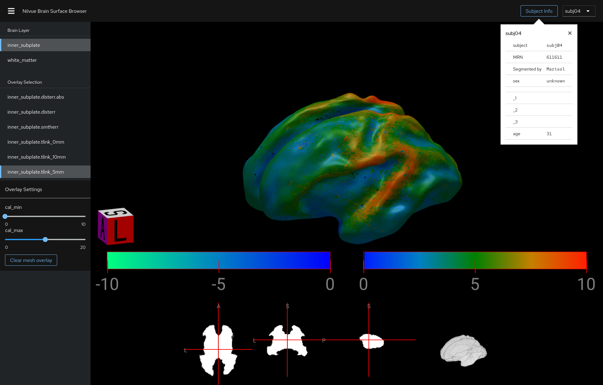

# Niivue Hemisphere Surface Browser

[](./LICENSE)
[](https://github.com/FNNDSC/niivue-browser/actions/workflows/build.yml)

An opinionated [NiiVue](https://github.com/niivue/niivue) application for browsing surface meshes found in a filesystem directory.

Demo: https://niivue-hosting-of-medical-image-analysis-platform-dcb83b.apps.shift.nerc.mghpcc.org/



## Usage

Prepare your data to adhere to the [naming conventions](#naming-conventions). Then, run

```shell
docker run --rm --name niivue-browser \
    -p 2019:2019 -p 8080:8080 \
    -v "/path/to/your/data:/data:ro" \
    ghcr.io/fnndsc/niivue-browser:latest
```

- The application will be available at http://localhost:8080/.
- Prometheus metrics can be read from http://localhost:2019/metrics. See https://caddyserver.com/docs/metrics for more information.

## Naming Conventions

- The data directory should contain subdirectories where each subdirectory contains the files for one subject.
- Data files may represent: brain hemisphere volumes, hemisphere masks, hemisphere surfaces, or hemisphere surface data.
  For example, you could have a white matter surface mesh and sulcal depth data for that surface.
  Supported file formats include `.nii`, `.nii.gz`, and `.mz3`. We recommend using
  [`niivue-browser`](https://github.com/FNNDSC/niivue-browser/) to convert from MNI formats (`.mnc`, `.obj` and `.txt`).
- Data file names must be prefixed with `lh.` for left hemispheres or `rh.` for right hemispheres.
- Associated data files must have the same file name, not considering the `lh.`/`rh.` prefix nor file extension.
  For example, `lh.wm.mz3` and `rh.wm.mz3` will be recognized together as "wm" surfaces.
  Likewise, `lh.wm.disterr.mz3`, `lh.wm.smtherr.mz3`, `lh.wm.tlink_10mm.mz3` will be recognized as surface data
  for the `lh.wm.mz3` surface. Rules for file name recognition are coded in [`src/lib/recognize.ts`](src/lib/recognize.ts).
- An optional CSV file can be located in the data directory, which provides details about each subject. This CSV
  file must have a column titled "subject" (case-insensitive). Other columns may contain arbitrary string data.

Download some sample data:

```shell
curl -sf https://stack.nerc.mghpcc.org:13808/swift/v1/AUTH_2dd3b02b267242d9b28f94a512ea9ede/fnndsc-public/samples/fetal_brain/sample_human_fetus_brain_mri_subplate_surfaces.tar.gz | tar xvz
```

## Development

1. Create a directory (or symlink) `./data` which contains subdirectories, where each subdirectory contains
   data for a single subject. Optionally, place a file called `./data/*.csv` which provides metadata about subjects.
2. Run `pnpm run dev` and `pnpm run dev:proxy` concurrently.
3. In your browser, open up `http://localhost:51733/`

## Deployment

Examples for how to deploy on Kubernetes/OpenShift can be found here:

https://github.com/FNNDSC/NERC/tree/master/niivue-browser
